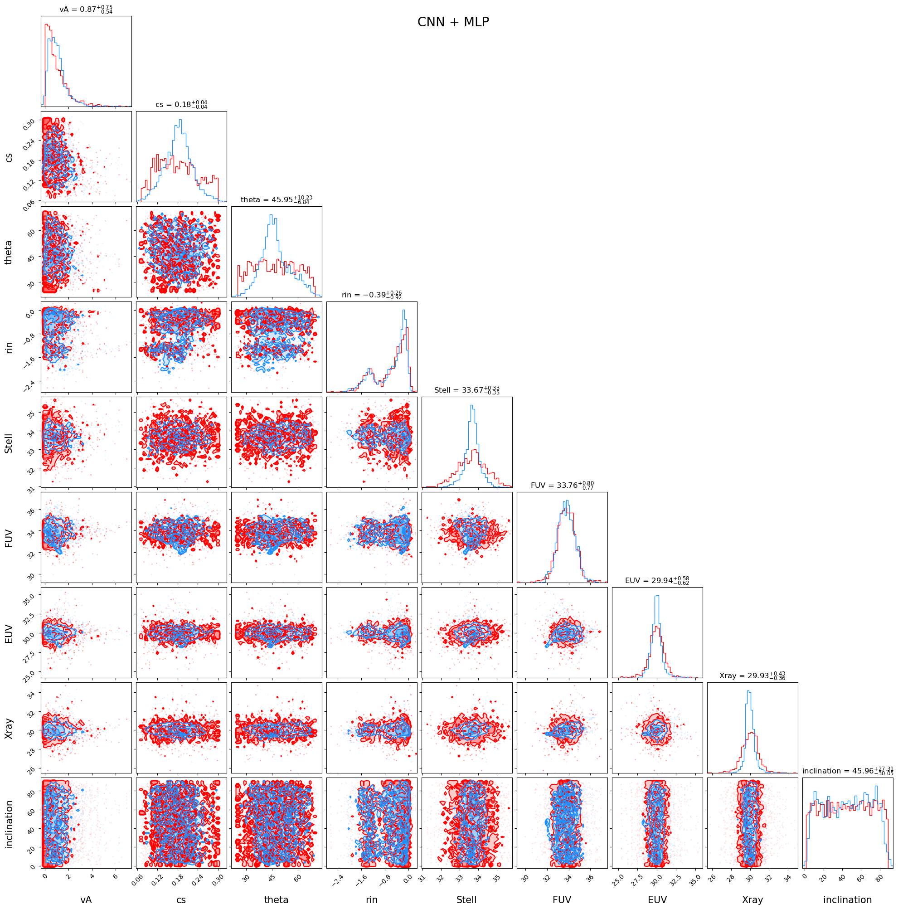
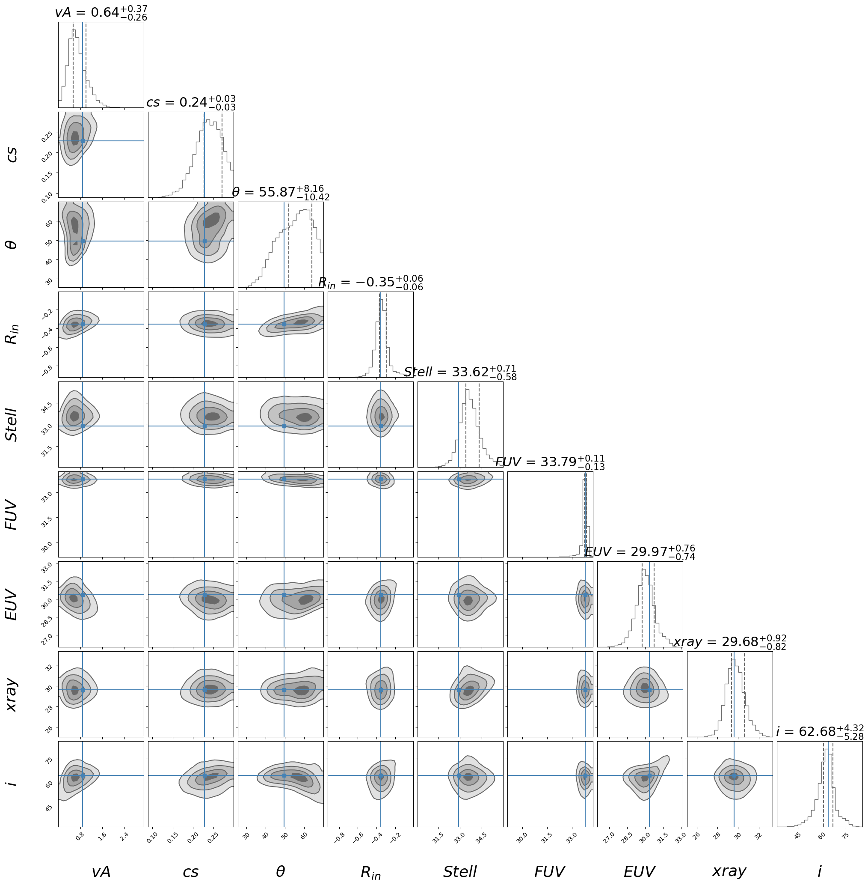
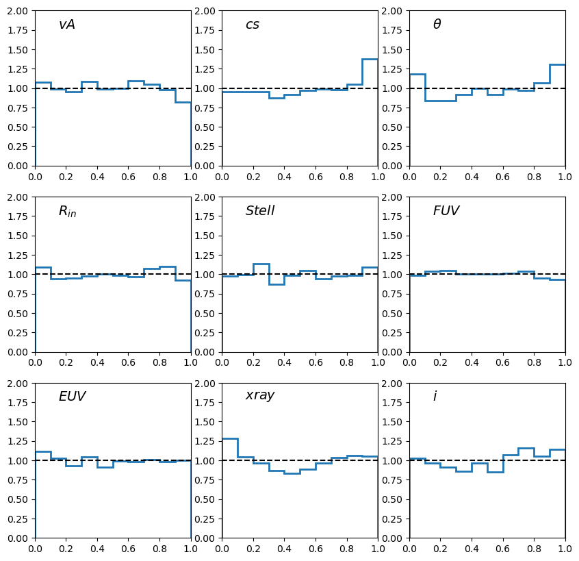

# Spectra Compression + Simulation-Based Inference for Protoplanetary Disk Winds

This repository implements the **workflow** used in:

**Nemer et al. (2024), _The Astrophysical Journal_, 965, 157** — “Constraining Protoplanetary Disk Winds from Forbidden Line Profiles with Simulation-based Inference.”  
DOI: `10.3847/1538-4357/ad34b3`

The goal is to infer **posterior distributions** over wind parameters given a forbidden-line spectrum (e.g. [OI] 6300 Å) by combining:

1. a **fast supervised regressor** that produces a point estimate \(\hat{\theta}\) from a spectrum \(x\), and  
2. **Simulation-Based Inference (SBI)** that calibrates that point estimate into a full posterior:

\[
p(\theta \mid \hat{\theta}).
\]

This design is useful when you want:
- **speed** at inference time (regressor),
- **uncertainty + correlations** (posterior), and
- you have (or can generate) paired simulations \((\theta, x)\).

---

## What `ppd_sbi_pipeline.py` does

### Stage 0 — Load data
Reads an HDF5 simulation file containing:
- `spec`   : `(N, L)` simulated spectra
- `wave`   : `(L,)` wavelength/velocity grid
- `params` : `(N, 9)` true parameter vectors

Optionally reads a 3-column observation text file:
- `wave, flux, err`

### Stage 1 — Train a regressor (two options)
Choose either:
- **CNN regressor** (`--regressor cnn`) — no external dependencies beyond PyTorch  
- **Spender regressor** (`--regressor spender`) — uses `spender.SpectrumEncoder` (preferred)

The regressor is trained on **mock spectra** generated by:
- rebining simulations to the observation grid
- adding Gaussian noise using the observation error vector with an **SNR annealing schedule**

It outputs a point estimate:
\[
\hat{\theta} = f_\phi(x).
\]

### Stage 2 — Train an amortized posterior via SBI
Using SNPE + MAF (normalizing flow), the pipeline trains:
\[
p(\theta \mid \hat{\theta}).
\]
That is: conditioning on the regressor output (the “summary statistics”).

### Diagnostics
- **Rank statistics (SBC-style)**: if the posterior is calibrated, rank histograms are ~uniform.
- **Posterior corner plot** (optional; requires `corner`).

---

## Parameters (9D)

Default parameter labels and prior bounds are embedded in the script:

```python
lower_bounds = [0.0, 0.0, 25.0, -3.0, 30.0, 29.0, 24.0, 25.0, 1.0]
upper_bounds = [8.0, 0.3, 70.0, 2.0, 36.0, 38.0, 36.0, 36.0, 90.0]
labels = ['vA', 'cs', 'theta', 'rin', 'Stell', 'FUV', 'EUV', 'Xray', 'inclination']
```

You can override these with `--prior_low ... --prior_high ...` and `--labels ...`.

---

## Installation

Create a virtual environment:

```bash
python -m venv .venv
source .venv/bin/activate
pip install -U pip
pip install numpy matplotlib torch sbi h5py tqdm
```

For **Spender mode**:

```bash
pip install spender
```

Optional (for corner plots):

```bash
pip install corner
```

---

## Quickstart

### Run end-to-end training + inference

#### Spender (preferred)

```bash
python ppd_sbi_pipeline.py \
  --sim_h5 data/simulations.h5 \
  --obs_txt data/observation.txt \
  --outdir outputs/run_spender \
  --regressor spender \
  --device cuda
```

#### CNN baseline

```bash
python ppd_sbi_pipeline.py \
  --sim_h5 data/simulations.h5 \
  --obs_txt data/observation.txt \
  --outdir outputs/run_cnn \
  --regressor cnn \
  --device cuda
```

If you have **no observation file**, omit `--obs_txt`. The code will use the simulation grid as a proxy and a constant error model.

---

## Outputs

All outputs are written under `--outdir`:

- `regressor.pt` — trained regressor weights
- `snpe_estimator.pt` — trained SNPE density estimator weights
- `theta_hat_obs.npy` — regressor prediction for the observation spectrum
- `posterior_samples_obs.npy` — posterior samples for the observation
- `regressor_losses.png` — training curve
- `posterior_corner.png` — posterior corner plot (if `corner` installed)
- `rank_hist.png` — SBC rank histograms
- `ranks.npy` — rank statistics array
- `figures/` — convenience copies for README embedding

---

## Figures (generated by the code)

```



```

---

## Running without the original data

This repository does not ship with the simulation dataset.

To test installation only:

python -c "import torch, sbi, h5py; print('Environment OK')"


## Citation

```bibtex
@article{Nemer2024ApJ965157,
  author  = {Nemer, Ahmad and Hahn, Chang Hoon and Li, Jiaxuan and Melchior, Peter and Goodman, Jeremy},
  title   = {Constraining Protoplanetary Disk Winds from Forbidden Line Profiles with Simulation-based Inference},
  journal = {The Astrophysical Journal},
  volume  = {965},
  number  = {2},
  pages   = {157},
  year    = {2024},
  doi     = {10.3847/1538-4357/ad34b3},
  eprint  = {arXiv:2403.10243}
}
```
